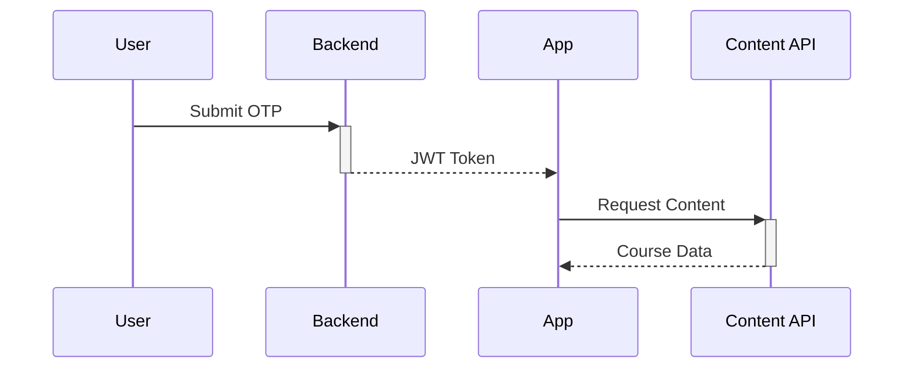

# Sheshya Learning Game

🚀 Interactive educational platform combining gaming mechanics with curriculum-based learning

## Features
- 📱 Mobile-first Flutter implementation
- 🔐 Secure OTP-based authentication
- 📚 Dynamic course content loading
- 🎮 Gamified learning experience
- 🔄 Real-time API integration

## Installation

### Prerequisites
- Flutter 3.7+ 
- Dart 2.19+
- Android Studio/Xcode for emulation
- Node.js 16+ for API mocking

```bash
# Clone repository
git clone https://github.com/Menatic/Sheshya-flutter-app.git
cd flutter-task

# Install dependencies
flutter pub get

# Setup environment
cp .env.example .env

# Run development server
flutter run
```

## API Integration
```dart
// Authentication Example
static Future<String?> login({required String email, required String otp}) async {
  // API call to loginByEmailOrPhone endpoint
}

// Content Fetching
static Future<Map<String,dynamic>> fetchCourseContent({
  required String token, 
  required String className
}) async {
  // Retrieves course content from createCourseContent endpoint
}
```

## Authentication Workflow


## UI Rendering
🎯 Interactive Components:
- Multiple-choice questions
- Drag-drop matching
- Progress tracking
- Achievement badges

## Error Handling
🛠️ Strategies Include:
- Network error recovery
- Token refresh flow
- Local data caching
```dart
try {
  // API operations
} catch (e) {
  showErrorSnackbar('Error: ${e.toString()}');
}
```
    
## Roadmap
✅ Current Version 1.0
- Basic authentication flow
- Core gameplay loop

🔜 Future Features
- Multiplayer challenges
- AI-powered hints
- Progress analytics
