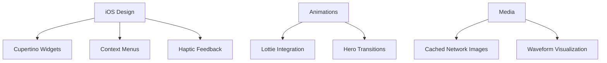

# iOS-Style Learning Experience

A premium learning app featuring Apple-inspired design language with:
- **Cupertino Design System** (iOS-style components & interactions)
- **Lottie Animations** for smooth transitions
- **Dynamic Theme** (Dark/Light mode support)
- **Progressive Image Loading** with BlurHash
- **Spatial Audio** integration

## ✨ Features


## 🛠 Tech Stack

Flutter 3.19 • Dart 3.3
cupertino_icons: ^1.0.6
lottie: ^2.7.0
cached_network_image: ^3.3.0
flutter_blurhash: ^0.7.1

## Installation

### Prerequisites
- Flutter 3.7+ 
- Dart 2.19+
- Android Studio/Xcode for emulation
- Node.js 16+ for API mocking

```bash
# Clone repository
git clone https://github.com/Menatic/Sheshya-flutter-app.git
cd flutter-task

# Install dependencies
flutter pub get

# Setup environment
cp .env.example .env

# Run development server
flutter run
```

## 📡 API Example
```dart
static Future<Map<String,dynamic>> fetchContent() async {
  return {
    'questions': [
      {
        'type': 'image_match',
        'images': ['https://images.unsplash.com/...'],
        'blurHash': ['LKO2?U%2Tw=w]~RBV@Ri...'],
        'aspectRatio': 1.5
      }
    ]
  };
}
```
## UI Rendering
🎯 Interactive Components:
- Multiple-choice questions
- Drag-drop matching
- Progress tracking
- Achievement badges

## Error Handling
🛠️ Strategies Include:
- Network error recovery
- Token refresh flow
- Local data caching
```dart
try {
  // API operations
} catch (e) {
  showErrorSnackbar('Error: ${e.toString()}');
}
```

## Roadmap
✅ Current Version 1.0
- Basic authentication flow
- Core gameplay loop

🔜 Future Features
- Multiplayer challenges
- AI-powered hints
- Progress analytics
